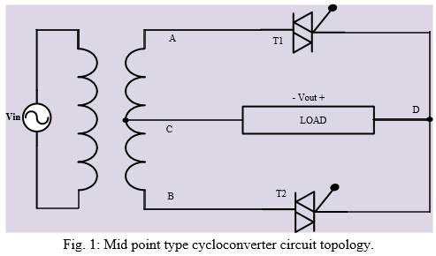
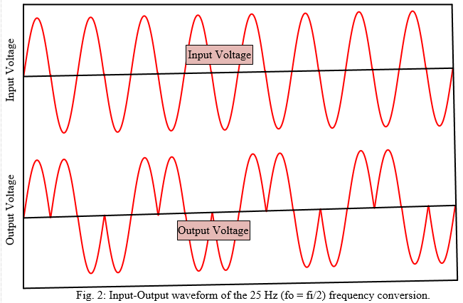
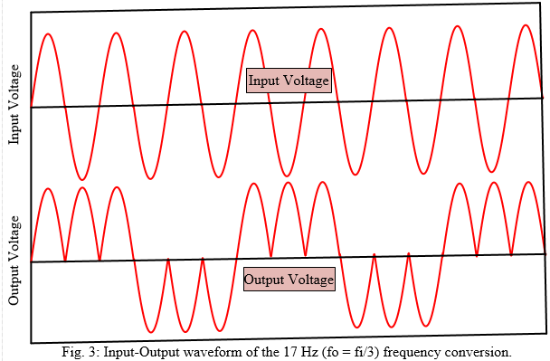

# Cycloconverter-(1P to 1P)
Triac based cycloconverter laboratory prototype hardware design and drive.

Here conventional single phase to single phase cyclo-converter laboratory prototype hardware is design for testing purpose of convertional cyclo-converter circuit topology.
It is known to all that there are two type of circuit topology.

     1. Bridge type topology
     2. Mid point type topology
This example show you how to drive a Mid point type cyclo-converter topology.

# Mid point type topology
Cycloconverter is used to convert a constant AC frequency into an adjustable AC frequency. Conventional mid-point cycloconverter shown in Fig. 1 uses two bidirectional TRIAC as switches and one center-tapped transformer. The output waveforms for mid-point cycloconverter always maintain a fixed ration i.e. fo = fi/3. The conversion techniques are shown in Fig. 2 and Fig. 3 for 25 Hz (fo = fi/2) and 16.67 Hz (fo = fi/3) frequency conversion of 50 Hz fuudamental respectively.

