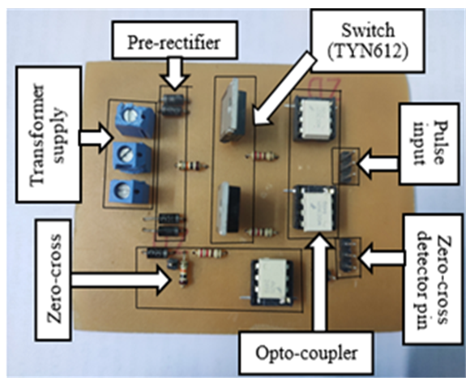

# Cycloconverter-(1P to 1P)
Triac based cycloconverter laboratory prototype hardware design and drive.

Here conventional single phase to single phase cyclo-converter laboratory prototype hardware is design for testing purpose of convertional cyclo-converter circuit topology.
It is known to all that there are two type of circuit topology.

     1. Bridge type topology
     2. Mid point type topology
This example show how to drive a Mid point type cyclo-converter topology.

### Mid point type topology
Cycloconverter is used to convert a constant AC frequency into an adjustable AC frequency. Conventional mid-point cycloconverter shown in Fig. 1 uses two bidirectional TRIAC as switches and one center-tapped transformer. The output waveforms for mid-point cycloconverter always maintain a fixed ration i.e. fo = fi/3. The conversion techniques are shown in Fig. 2 and Fig. 3 for 25 Hz (fo = fi/2) and 16.67 Hz (fo = fi/3) frequency conversion of 50 Hz fuudamental respectively.

 

### Hardware Implementation
The hardware implementation can be divided into two parts, including: 

     1. Circuit designing part,
     2. Software part (coding).

### Circuit designing
To build the mid point type circuit, the following components are used:
      
      1. 12-0-12 V centre tapped transformer,
      2. BT136 (bidirectional TRIAC)
      3. MOC3021 (gate driving opto-coupler)
      4. 4N35 (Zero-cross detector opto-coupler)
      5. Arduino Uno Micro-controller.

The following figures show the printed circuit board (PCB) design and prototype hardware of the mid-point type cycloconverter.
 

### Software/Coding 
To generate the gate driving pulse, Arduino uno board is used. The following pin's are used:
       1. INPUT: Digital pin-7
       2. OUTPUT: Digital pin-3, 2 (where 3 for T1 and 2 for T1 switch according to the designed circuit.)

Here, total four arduino files are uploaded. Just download the code and upload to your arduino uno board.

### Output
The following figures show the output voltage of the mid point type cycloconverter.

